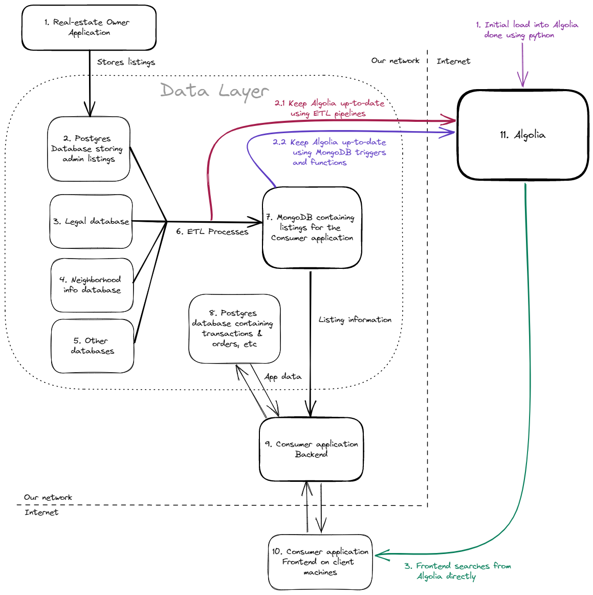

# Turbocharging Webshop search with Algolia and MongoDB

## Post 1 - Use-case, architecture and current challenges

### Introduction & problem statement

Being a Data Engineer at a mid-size company running multiple webshops is not only the best job I've had so far, but also one of the most challenging ones. We are a relatively small team that is maintaining multiple smaller real-estate websites that enable end users to sell / buy / rent homes across multiple countries. These are not classical webshops, as in some cases we only connect the supply and the demand, whereas in the case of renting, we actually manage transactions, orders, cancellations and communication. We have been expanding our scope of services a lot in the past few years, which allowed us to explore new business opportunities and improve our technological background as well.

We recently added a considerable amount of new services to our webshops, some of these are:

- Social Media integration
- Advanced SEO
- Possibility for registration of real-estate agents
- AI based recommendation system
- Real-estate history
- Neighborhood analysis

Because of these new services (and organic growth), the number of listings on our websites increased dramatically.

The growth of listings brought focus on the fact that our **search capabilities** was not meeting our clients' demands.

Customer surveys indicated that poor search results translated directly to a **loss of revenue** for us, so this quickly became top priority in our upcoming release cycle.

My task is to come up with a solution to improve the search capabilities of one of our webshops. This blog post goes through my journey in implementing a PoC of a Data Pipeline (and a basic frontend) that we can use as a starting point in implementing **advanced search** for our services.

### Current webshop architecture & data pipeline

Our architecture for this particular webshop is somewhat fractured. Our Consumer and Admin applications are completely separate, managed by different teams and they are connected on the data level only.

#### Real-estate Owner Application

The admin application is used by real-estate owners and agents to list their available properties for Buying and Renting, manage rent orders, see stats etc. It is an application managed by a different organization unit that I am in. It connects to a single database that contains the application data.

#### Consumer Application

This is the application that is available to our end users. It is marketed, available publicly, listed in Google, has advanced SEO and so on. My organization unit is responsible for this application. It is used by consumers to list properties that they are interested in buying & renting, handles financial transactions, communication with the real-estate owners and so on.

**I am involved in the Consumer webshop** - the Real-estate Owner application is completely out of scope for this use-case. 

#### Architecture

Our current architecture looks like the following:

I am managing the **Data Layer** for this project. The individual entities on the diagram are as follows:

1. **Real-estate Owner Application**: This is the application that real-estate owners and agents use to manage their listings. This is out of scope for this project, it appears on this diagram because it acts as a data source for some of the elements in our Data Pipeline.
2. **Admin listings database**: This is a postgres database that is managed by the *Admin application*. The created listings are stored here.
3. **Legal database**: Contains the legal & tax information for individual regions (cities, counties, countries) where our listings are located. This is maintained by our legal team.
4. **Neighborhood info database**: Contains information about individual neighborhoods, such as traffic data, nearby activities, schools, shopping/health/sport centers and so on. This is managed by a designated team.
5. **Other databases**: We also have a fair number of other smaller databases managed by different teams that contain relevant information for our listings. Some examples include travel times, sentiment analyses of regions, sale histories and so on.
6. **ETL processes**: This is my main focus as a Data Engineer. I am mostly responsible for the ETL workflows that aggregate and prepare the data from our source systems to provide a clear, concise and up-to-date way of storing our listings for our Consumer application. This includes a lot of pipelines that are running frequently to ensure that our listing information is always presented to our consumers in a timely fashion.
7. **Listings database**: This is the database that is prepared by the *ETL processes*. It contains the final listing information that can be presented to our end users. We use **MongoDB**, as our listings data is very board and flexible, with a lot of information being available for a single listing, and a document database provides a really fast and efficient way of querying this information without having to join hundreds of tables together. It also scales horizontally really well and does not require high transactional support.
8. **Database containing application data**: We also use a Postgres database to store Consumer Application data. This is mostly transactional data with a very strict, relational data model, so MongoDB was not the best choice for it. It mostly stores Transactions, Orders, Communication, Financial Data, User information and so on. This database is also connected to our Admin application - but since it is out of scope, it is not included on this diagram.
9. **Consumer application backend**: The backend of our Consumer Application sits inside a scalable Kubernetes environment. It retrieves the listings from the *Listings database* (7), and stores basic application data in the *Application database* (8). This is the only entity on the diagram that is exposed to the internet.
10. **Consumer application frontend**: This is our Frontend application that runs on the machines of our clients. It communicates with our Backend application only to retrieve listings and perform actions by end users.

### Challenges & possible solutions

Our main challenge is that the search capabilities of MongoDB are limited. 

#### Existing solutions supported by MongoDB

The cloud hosted version of MongoDB supports Atlas Search, which is a fine grained indexing solution, but it is not applicable to us as we are using an on-premise MongoDB instance. 

The on-premise version of MongoDB only supports Legacy Text search, but it is not capable of searching across multiple fields & full-text search. **This is what we are currently using**

#### ElasticSearch

We have experimented with an on-premise hosted version of **ElasticSearch** (and using the MongoDB River Plugin for synchronization), but hosting & fine-tuning ElasticSearch proved to be a difficult task for our team and it resulted in a very unpredictable searching experience which was not only slow in many occasions, but it was also inaccurate. 

In addition to these problems, integrating with ElasticSearch would also require us to modify our entire application stack - both the backend and the frontend of our application would need to be modified heavily to make it work. We would have to manage application security, write our own UX code, write complex indexing logic in code. 

We also have a lot of legacy code in our application. This means that there is a high cost of modifying, testing and deploying new versions, as it requires extensive domain knowledge and experience, which only a few members of the development team have.

Seeing these problems, we originally gave up on implementing with ElasticSearch - the development cost in both time and resources was deemed too great for the benefit that it would bring.

#### Algolia

After doing a bit of research into other possibilities, we stumbled upon **Algolia**. It is a cloud hosting search & indexing provider that promises very easy integration with existing solutions by providing easy-to-use backend and frontend integration SDKs.

The main reasons it caught our eye are:

- It is cloud native and promises very high scalability
- We can minimize the coding required to enable the capability, especially on the backend, which would definitely be a bottleneck. It also allows our data engineers and domain specialists to collaborate on the project and bring real value in implementing this feature. 
- Simplifies the search development process - does not require in-depth technical knowledge when it comes to defining optimized indexes and distribution
- Low maintenance & easy organization of large data volumes
- Easy to manage & configure search rules to improve search accuracy. Also offers AI based help for engineers to fine-tune performance
- Provides very easy-to-use frontend SDKs that can integrate with our existing frontend application
- It provides pre-configured analytics and KPIs, further reducing the development cost

For these reasons, I decided to build the PoC for our new search indexing capability using Algolia. 

## Post 2 - Proposed solution and design

### Architecture Challenges

When discussing the challenges of integrating a third party indexing system into our solution, most of our engineers instantly brought up two potential problems:

- Data Integrity and Data Readiness
- Potential application performance issues that can arise when introducing a new third party system
- Security & access control

#### Data Integrity

So far, we had one **single source of truth** database, which was our Listings database, where all are listings are stored.

When introducing Algolia into our ecosystem, we have to make it top priority that it is always **kept up-to-date** with our listings database. Having any sort of inconsistency between these systems can have a serious impact of user experience on our site. 

We wouldn't want to end up with a situation where a search result:

- throws a 404 Not Found error when clicked
- is not up-to-date with the listing itself (ie. the search result contains different title, description, etc)
- does not show up for an existing real-estate

All of these scenarios would result in a **loss of confidence** in our service and can directly be translated to a **loss of revenue**.

We have to be able to:

- Create an initial load of our existing dataset to Algolia
- Keep Algolia up-to-date with all the changes in our dataset

#### Performance issues

Our backend application is already under heavy load. It is scaled horizontally using Kubernetes, but we want to avoid greatly increase the cost of operations due to an increased amount of traffic that goes through our servers.

When designing a solution, we have to make sure to offload as much traffic as possible to Algolia.

#### Security & access control

When adding Algolia to our ecosystem, we have to make sure that we don't compromise our applications security & access control. Currently our application does not require a logged-in session when querying listings, so this is not as important.

In case a user is logged into our application, it would be a nice to have feature to be able to store the users' identity with the Algolia search so it can be used for reporting later.

### Design possibilities

There are at least 3 deliverables that have to be created in order to make this work:

1. We have to be able to index all of our existing listing data inside Algolia
2. We have to be able to keep the Algolia index up-to-date with any listing changes (added/edited/deleted)
3. We have to be able to search the Algolia frontend directly from the frontend so that we can avoid modifying the legacy backend code. 

For keeping the Algolia index up-to-date, (2), I see two potential options:

- We can create python scripts that we are able to run as part of our ETL processes to maintain the Algolia index
- We can create MongoDB Triggers & Functions to keep the Algolia index up-to-date

The updated architecture diagram would look like the following:

As part of the implementation, I want to implement all 4 workflows:

1. Create a python script that can be used to load the existing data into Algolia. I will be using Jupyter Notebook to develop this logic, parts of which can be turned into a python scripts that can be used for other workflows.

2. Since I am not yet sure which road to take in keeping the Algolia index up-to-date, I will implement both possibilities and compare them later.

   - The first is a python script that is ran as part of my ETL processes when the Listings database is loaded. It updates the Algolia index at the same time when the database is updated

     - **Advantages**:

       - I control when the Algolia index is updated

       - It is ran as separate task in my existing ETL process, so it can be monitored & maintained easily

     - **Disadvantages**:

       - If the Database load task succeeds and the Algolia task fails, Data Inconsistency will happen. Even though MongoDB supports transactions, Algolia does not [[[Does it?]]]
       - May be maintenance heavy if the tasks fail for any reason, since it is top priority that the data in the two systems is kept in sync

   - The second approach is through MongoDB triggers & functions. When a record is added / removed / edited in MongoDB, it can directly be synced into Algolia through a Database Trigger setting off a Function that calls the Algolia REST API

     - **Advantages**:
       - The Algolia index is automatically kept up-to-date based on the actions done in MongoDB without the need to implement third party solutions
     - **Disadvantages**: 
       - Potential performance issues - MongoDB operations may take very long
       - Triggers may fail. Monitoring failed triggers must be done through the MongoDB interface

3. Create a small web based frontend that is able to query the index in Algolia. I want to be able to show our frontend developers a working solution with basic code, so they can evaluate the time and effort required to integrate it into our existing frontend application

After the implementation, I will evaluate the performance of my workflows and decide which workflow I want to use for keeping the Algolia index up-to-date (2).

### Dataset & technologies used for implementation

To keep the implementation simple, I will use a dataset that is publicly available for MongoDB and is similar to my production data.

The reasons behind this are:

- [[[[ **OPTIONAL???** I want my scripts to be generic enough to be used for more than one of our web applications in the future. For this, they need to be generalized so they are able to be configured for different datasets. The best way to enforce this is to design & develop the scripts for something that is different than my final dataset. This way, I can test the adaptibility of the scripts simply by running it against my production data later]]]]]
- I want to be able to provide the dataset publicly, so the community can try it, provide feedback and help me improve my approach if needed.
- I don't want to be on VPN when I am reading the MongoDB database, as it would give me unrealistic performance counters (our VPN is super slow)

I decided to go with MongoDBs official [Sample AirBnB Listings Dataset](https://www.mongodb.com/docs/atlas/sample-data/sample-airbnb/) as it is closest to our data structure from all the publicly available sample datasets that I have found.

I will also use [MongoDB Atlas](https://www.mongodb.com/atlas/database) to host my sample Database, and a free [Algolia](https://www.algolia.com/) trial to store the records.

As previously mentioned, I will use Python and Jupyter Notebook to write the scripts required as it's the language I'm most familiar with and it is also what we use for most of our data transformation workflows.

For the sample Frontend, I will use HTML + JS + CSS, which I am a complete beginner in, so it will be a perfect opportunity to evaluate if the Algolia SDKs are indeed as simple to use as promised. 

## Post 3 - Data pipeline implementation

## Post 4 - Frontend implementation

## Post 5 - Measuring performance & conclusion